# 🏗️ Trade Journal Pro - Architecture Overview

## System Architecture

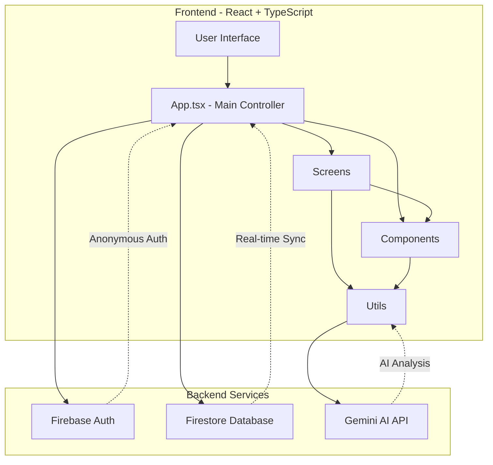

---

## Component Hierarchy

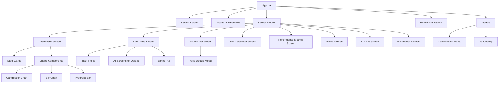

---

## Data Flow

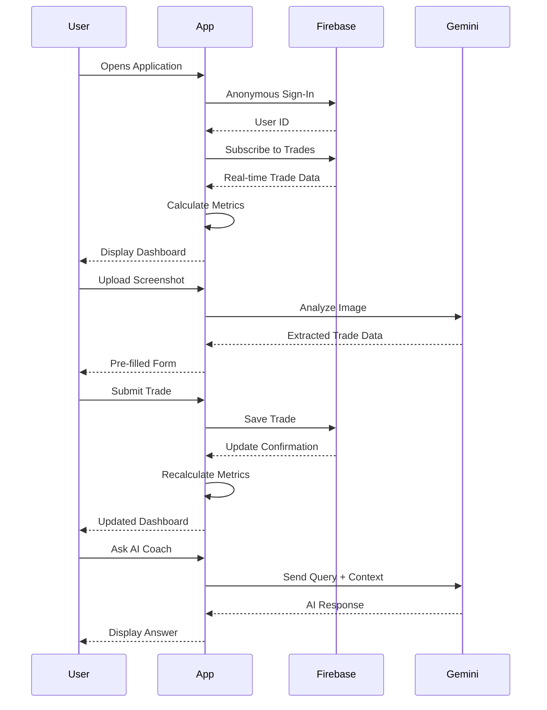

---

## State Management

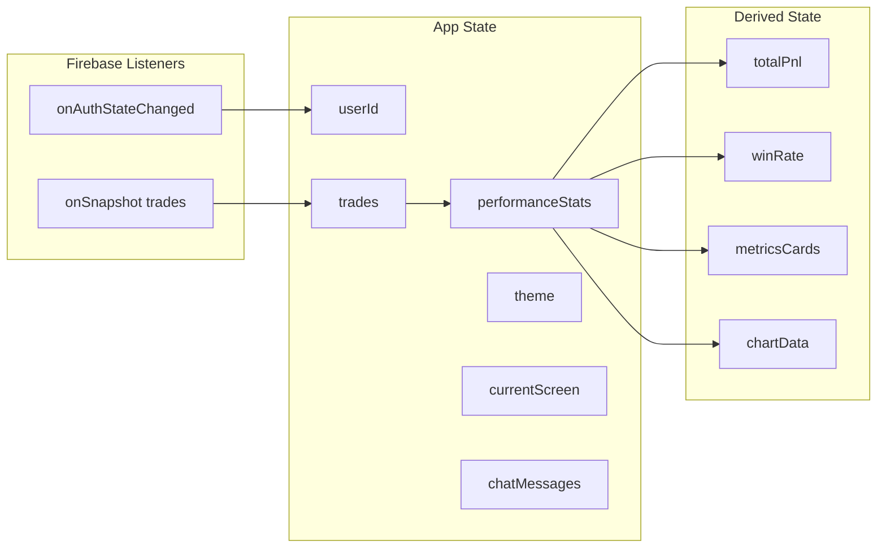

---

## File Dependencies

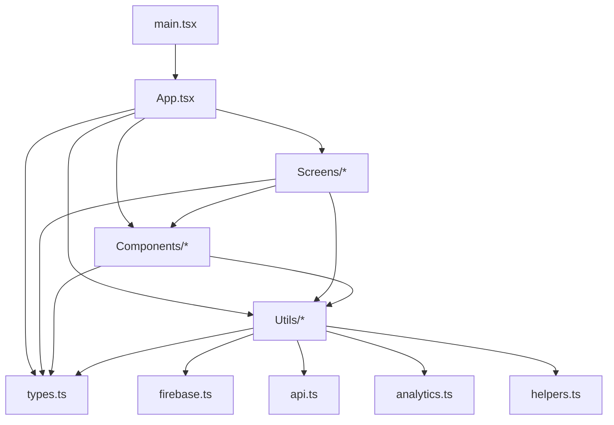

---

## API Integration Flow

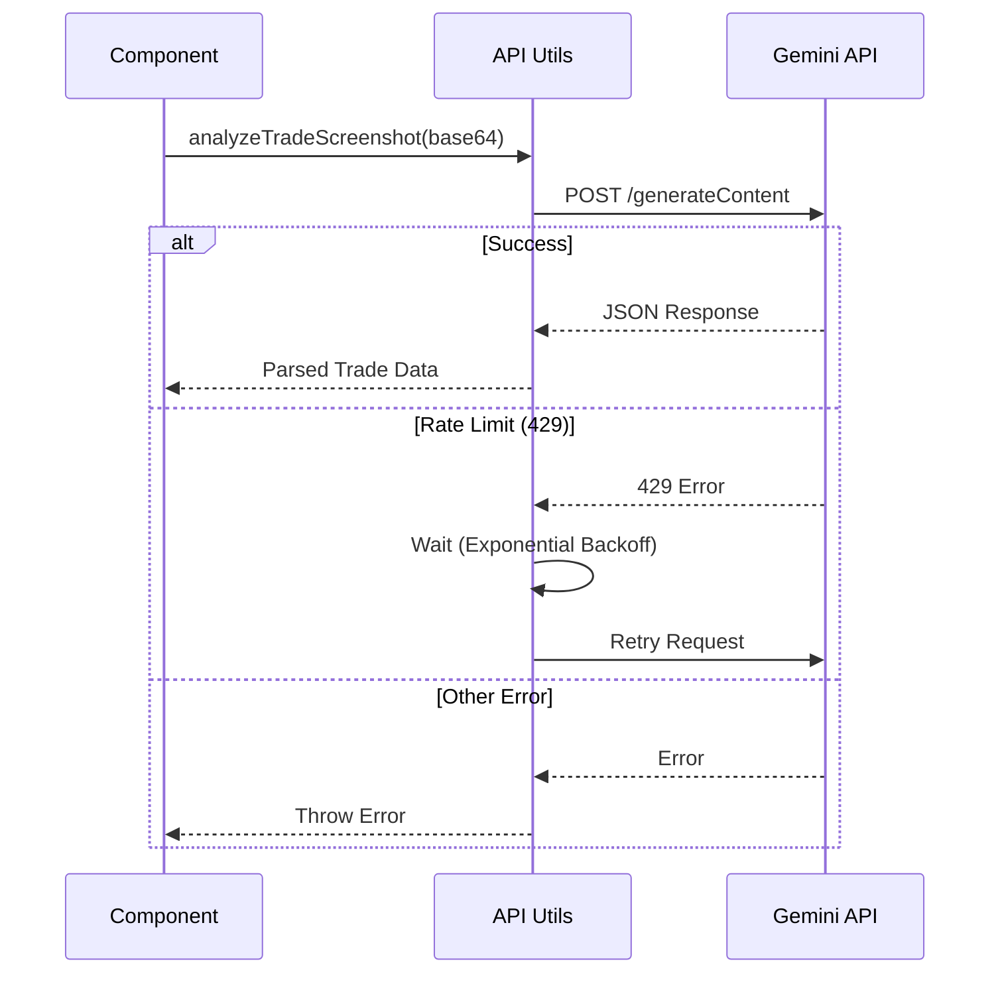

---

## Firebase Data Structure

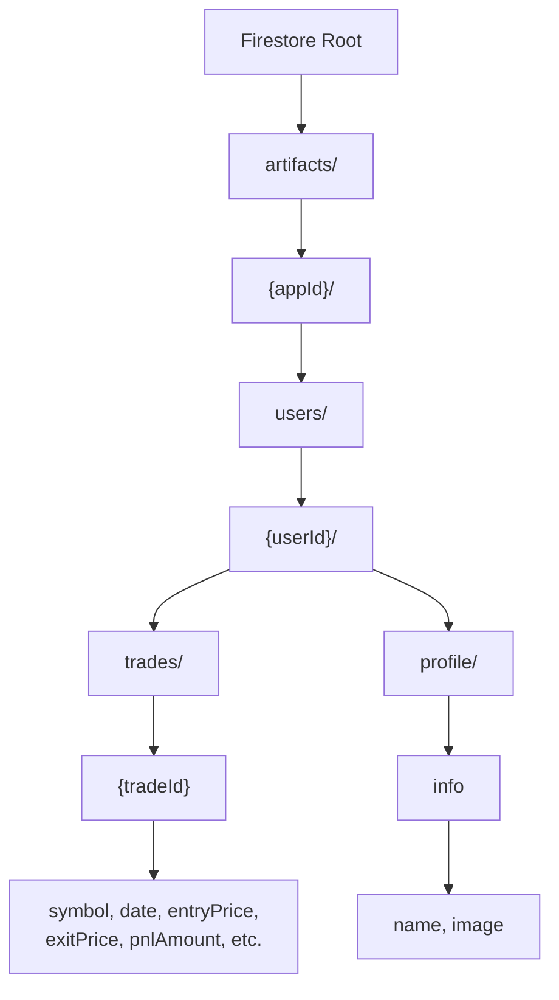

---

## Performance Metrics Calculation Flow

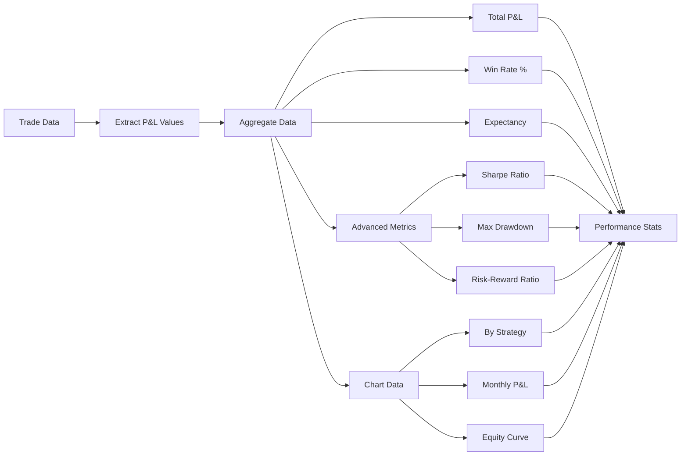

---

## Screen Navigation Flow

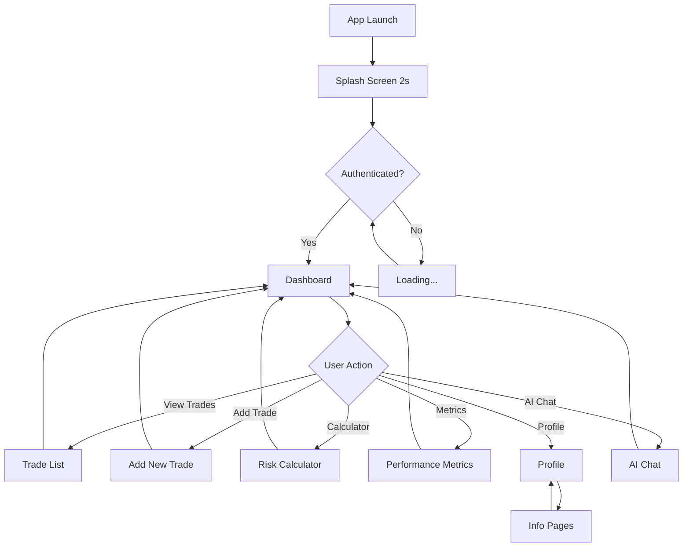

---

## Theme System

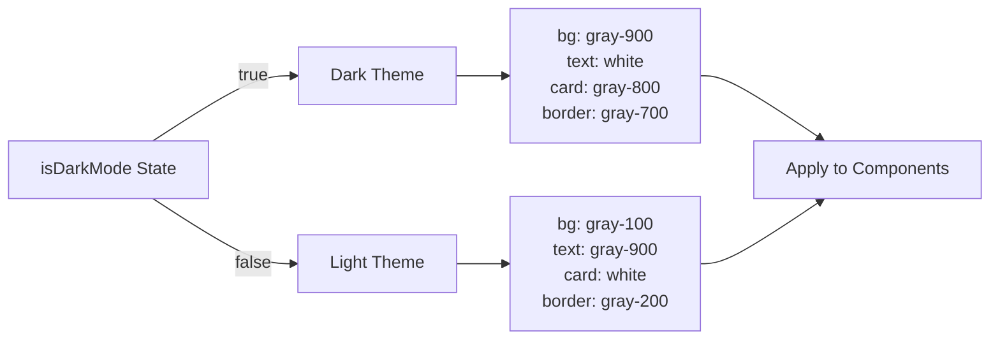

---

## AI Features Architecture

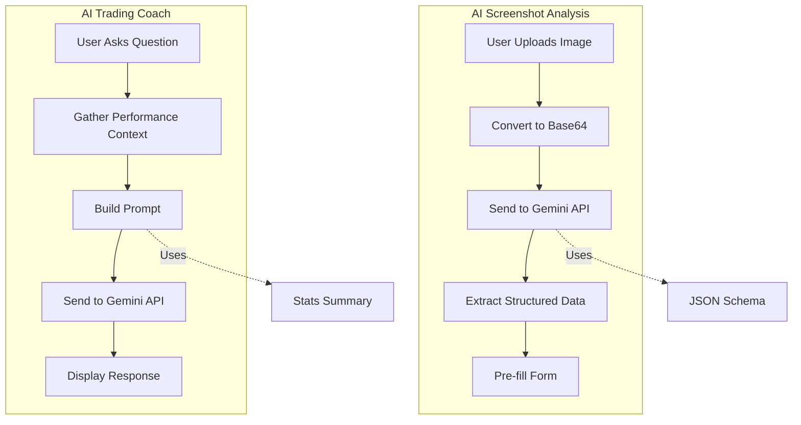

---

## Build & Deployment Pipeline

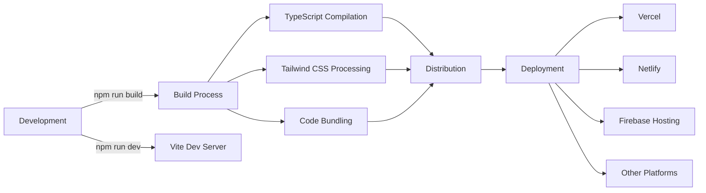

---

## Error Handling Strategy

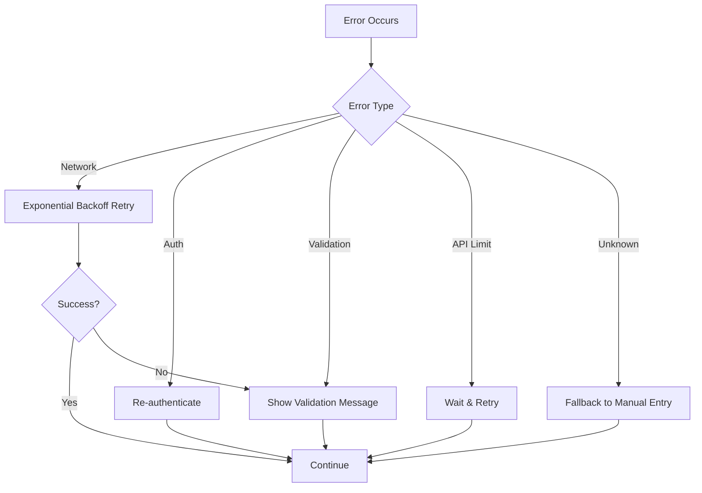

---

## Security Architecture

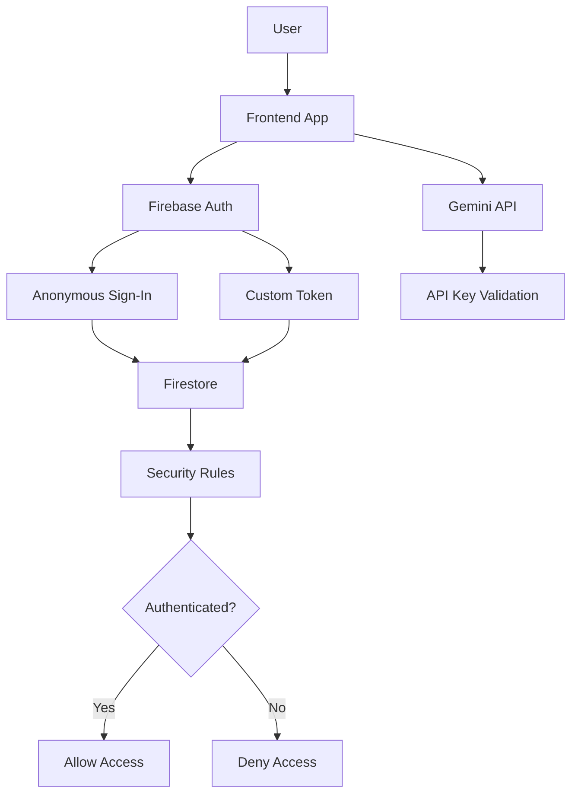

---

## Performance Optimization

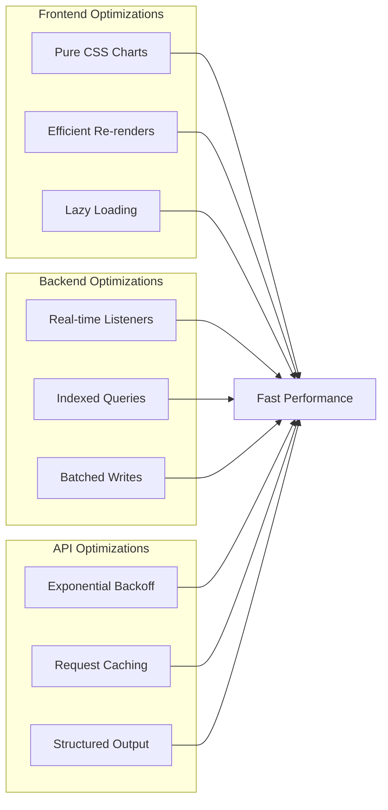

---

## Responsive Design Breakpoints

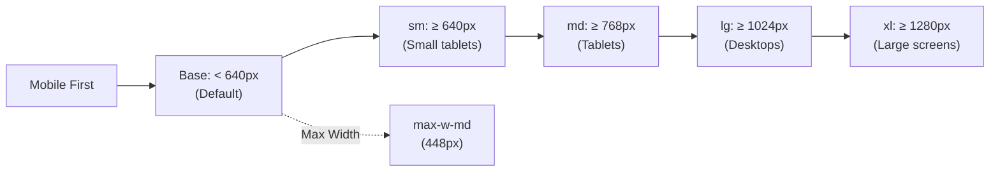

---

## Key Technologies Integration

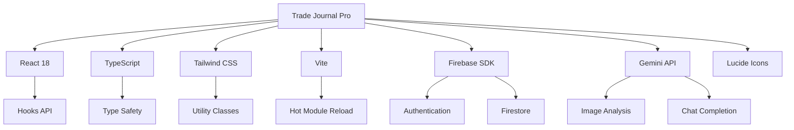

---

## Summary

This architecture provides:

- ✅ **Modular Design** - Separated concerns (screens, components, utils)
- ✅ **Type Safety** - Full TypeScript coverage
- ✅ **Real-time Data** - Firebase listeners for instant updates
- ✅ **AI Integration** - Gemini API for analysis and coaching
- ✅ **Responsive UI** - Mobile-first Tailwind CSS
- ✅ **Error Handling** - Comprehensive error recovery
- ✅ **Performance** - Optimized rendering and calculations
- ✅ **Security** - Firebase authentication and rules
- ✅ **Scalability** - Clean architecture for future growth

**The application is production-ready and follows industry best practices!** 🚀
